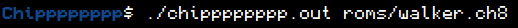
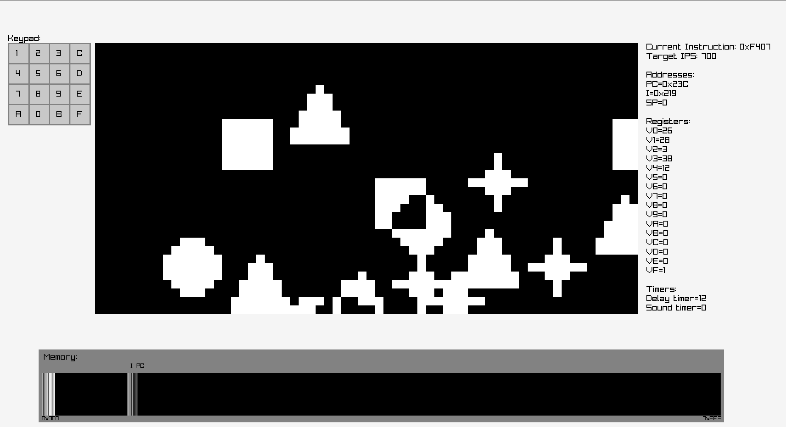
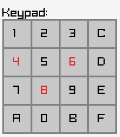
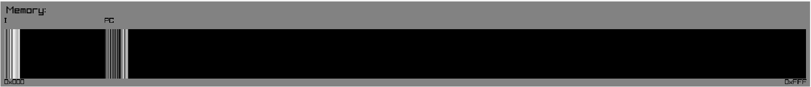

# Chipppppppp: CHIP8 Emulator with Grapical Interface
**Chipppppppp (Chip with 8 p's) is an interpreter for Linux systems capable of running programs written in CHIP8:** a programming language created for 8-bit computers in the 70's. 

[Learn more about CHIP8](https://en.wikipedia.org/wiki/CHIP-8)

## Playing CHIP8 Games on Chipppppppp
You can play any program written in CHIP8 on Chipppppppp by passing it as a command line argument:

The repository already contains 4 programs written by me in the roms/ directory:
- **fibonacci.ch8**: a program that prints fibonacci numbers to the display in a loop
- **shapes.ch8:** a program that prints basic shapes on the display, showcasing  CHIP8's random number generator and 1-bit display
- **type.ch8**: a program that prints on the display what button was most recently pressed
- **walker.ch8:** a basic game where you can make a sprite move across the screen using your keyboard

You are of course free to create your own programs and games or download them from the internet.

There is also a command line version of Chipppppppp, this is however not meant for regular play and is more useful for debugging.
## Features
### Emulator
To be precise, CHIP8 is a programming language rather than a hardware device. Which makes Chipppppppp an interpreter rather than an emulator. However it is common to refer to modern CHIP8 interpreters as emulators since they emulate the 8-bit systems CHIP8 was designed for. Building a CHIP8 interpreter is generally considered a good first step for those looking to get into programming emulators.

Chipppppppp's emulator was programmed entirely in C in the emulator/chip8.c file, it implements the process of instruction fetching, decoding, and executing. It also provides a variety of error codes in case of errors, such as invalid instructions or stack overflows.

The control panel capable of pausing and unpausing the emulator's execution at any point, as well as changing its speed and stepping through instructions one-by-one.
### Graphical Interface

Chipppppppp's graphical interface, built with raylib, allows to monitor various aspects of the virtual CHIP8 machine:
- CHIP8's 64x32 1-bit display is drawn in the middle
- A graphical representation of the keypad is drawn on the left
- Information about the processor, such as the values of the registers, the program counter, the current instruction, and the timers is displayed on the right and updated in real time
- A diagram showing the state of the machine's 4Kb RAM is drawn at the bottom
- Errors encountered during execution are drawn at the top

### User Input
CHIP8 supports up to 16 buttons for user input, labeled 0-F. Chipppppppp allows you to control these buttons with the left-most keys on your keyboard (1, 2, 3, 4, Q, W, E, R, T, A, S, D, F, Z, X, C, and V on QWERTY keyboards). The graphical interface will show which keys are pressed at any given time:

Chipppppppp also has other controls to manage program execution:
- **Pause/unpause execution and timers**: Space
- **Execute exactly 1 instruction**: Left Click while paused
- **Decrease timer registers by 1**: Right Click while paused
- **Increase emulator speed**: Keypad + or Arrow UP
- **Decrease emulator speed**: Keypad - or Arrow DOWN

### Memory Monitoring

The diagram at the bottom of the interface displays the contents of the RAM and is updated in real time as the program executes. The shade of the bars in the diagram corresponds to the actual byte values in each memory location, with pure white and pure black corresponding to 0xFF and 0x00 respectively.

Thanks to the diagram we can clearly see the organization of information in the program, such as the place where program code starts at location 0x200. As well as the first 512 bytes reserved by the interpreter. In Chipppppppp's case, this region contains hex sprites starting at 0x000 and the stack that grows downwards from 0x1FF.

The diagram also shows two small "I" and "PC" icons, which follow the address pointed to by the I register and the program counter respectively. Which allows tracking of the program's control flow.

### Sound
The machines CHIP8 was designed for included a buzzer that made sound whenever the sound timer's register contained a nonzero number. Chipppppppp emulates this functionality using raylib's music streams. The sounds/ directory contains some .wav files of square and sawtooth waves of various frequencies, although you are free to use your own sounds. The sound Chipppppppp uses can be changed by changing the beep_filename variable in controlpanel/controlpanel.c and recompiling.

## Compiling Chipppppppp
Chipppppppp was developed and tested exclusively on Linux and uses pthreads, so it will not work in other enviroments.

To compile Chipppppppp you must first install raylib. See [their page](https://github.com/raysan5/raylib) for instructions.

Then, you only need to clone this repository and build Chipppppppp using the makefile:
- **main**: compiles Chipppppppp's emulator and graphical interface and produces chipppppppp.out as an executable
- **cli** compiles Chipppppppp's emulator and command line interface used for debugging and produces cli.out as an executable
- **clean**: cleans up the directory by removing chipppppppp.out and cli.out if they are present
- **controls**: prints the Chipppppppp controls
- **help**: shows available build targets
## Credits
- [Cowgod's CHIP8 Technical Reference](http://devernay.free.fr/hacks/chip8/C8TECH10.HTM) which was instrumental in programming the emulator
- The [raylib](https://www.raylib.com) library on which the user interface was built
- Joseph Weisbecker, creator of CHIP8 and the 1802 microprocessors it was first designed for
